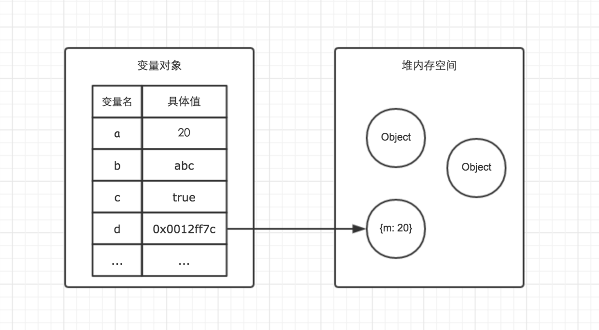
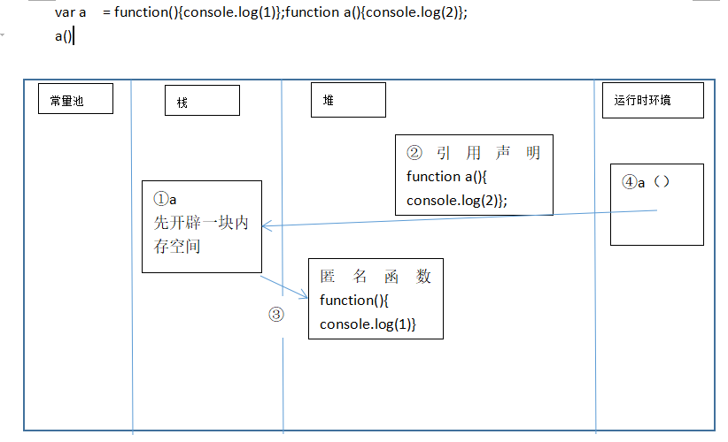

## js内存空间
栈数据结构的一个特点就是后进先出
堆数据结构，好比书架上的书，虽然已经按顺序放好了，但是我们只要知道书的名字，就可以对应的取下来，类似于JSON对象中的key-value
## js数据存放
基本类型有Undefined、Null、Boolean、Number、String，引用类型有Object
在程序运行的时候，整块内存可以划分为常量池（存放基本类型的值）、栈（存放变量）、很大的堆（存放对象）、运行时环境（函数运行时）


基本数据类型的值是直接在常量池里面可以拿到，而引用类型是拿到的是对象的引用
先定义后执行，其实就是在栈中先开辟一块内存空间，然后在拿到他所对应的值，基本类型去常量池，引用类型去堆拿到他的引用
example
```js
function a(){console.log(2)};
var a  = function(){console.log(1)};
a()
```

先定义后执行，先去栈查找
```js
a(); function a(){console.log(666)}//666
```
```js
a(); var a = function (){console.log(666)}
```
虽然第一种方法有变量提升，不会出错，正常来说，还是按顺序写，定义语句放前面。如果想严格要求自己，就手动来个严格模式‘use strict’吧。对于框架的开发，需要严谨遵守规则，所以一般会用严格模式。
## 引用数据类型和基本数据类型存放原因
栈比堆的运算速度快，Object是一个复杂的结构且可以扩展：数组可扩充，对象可添加属性，都可以增删改查。将他们放在堆中是为了不影响栈的效率。而是通过引用的方式查找到堆中的实际对象再进行操作。
## 函数
```js
var a = 10;
function() {
	console.log(a);//undefined
	var a = 1;
	console.log(a)//1
}
```
为什么不出去找全局的a？ 
就近原则。为什么就近原则？都确定函数内部有定义了，就不会再去外面白费力气。其实是，函数在自己的作用域内找到就不会再再继续找，类似原型链一样，在构造函数里面找到某个属性就不会去原型找，找不到才去，再找不到就再往上。函数也是，沿着作用域链查找。
## 内存垃圾回收机制
垃圾回收机制会定期（周期性）找出那些不再用到的内存（变量），然后释放其内存。
#### 标记清除法
是当变量进入环境时，将这个变量标记为“进入环境”。当变量离开环境时，则将其标记为“离开环境”。标记“离开环境”的就回收内存。
工作流程：

垃圾回收器在运行的时候会给存储在内存中的所有变量都加上标记。

去掉环境中的变量以及被环境中的变量引用的变量的标记（闭包）。

依然被标记的会被视为准备删除的变量。

垃圾回收器完成内存清除工作，销毁那些带标记的值并回收他们所占用的内存空间。
#### 引用计数法
跟踪记录每个值被引用的次数。
工作流程：

声明了一个变量并将一个引用类型的值赋值给这个变量，这个引用类型值的引用次数就是1。

同一个值又被赋值给另一个变量，这个引用类型值的引用次数加1.

当包含这个引用类型值的变量又被赋值成另一个值了，那么这个引用类型值的引用次数减1.

当引用次数变成0时，说明没办法访问这个值了。

当垃圾收集器下一次运行时，它就会释放引用次数是0的值所占的内存。
#### 内存泄露等相关问题
使用了内存之后， 如果后面他们不会再被用到，但是还没有及时释放，这就叫做内存泄露（memory leak）。如果出现了内存泄露，那么有可能使得内存越来越大，而导致浏览器崩溃。

请转：https://github.com/950905/record-summary/blob/master/optimization/%E5%BC%80%E5%8F%91%E4%B8%AD%E5%B8%B8%E8%A7%81%E7%9A%84%E5%86%85%E5%AD%98%E6%B3%84%E9%9C%B2.md

## 其他
以内存为基础，一步一步的理解JavaScript的执行上下文，作用域链，闭包，原型链等。