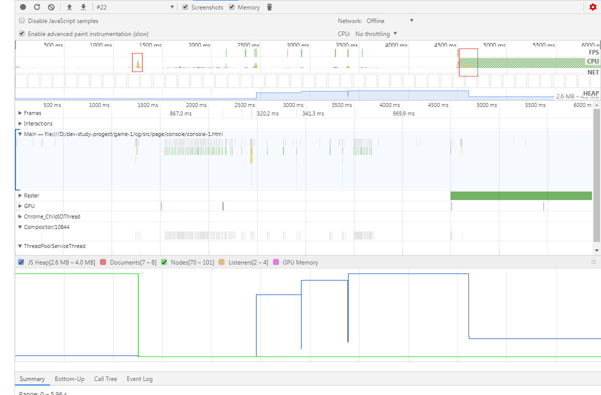

## 对象赋值
```js
var a = {
  name: 'test1',
  age: 1
};
var b = a;
a = {
  name: 'test2',
  age: 2
};
 
console.log(a);
console.log(b);
```
我们第一次声明a并赋值的时候系统为我们申请了一块儿内存并将地址指向了a，然后将a赋值给b，系统将指向a的内存地址同时指向了b，接着a重新赋值切断了之前赋值时a与指向的内存地址之间的联系，又重新申请了一块儿内存指向了a，而原来指向a的那块儿内存还是在内存中，所以b还是之前a的值。所以在编写代码的过程中应该尽量避免对对象变量直接赋值。
## 意外的全局变量

### 定义
JavaScript对未声明变量的处理方式：在全局对象上创建该变量的引用(即全局对象上的属性，不是变量，因为它能通过`delete`删除)。如果在浏览器中，全局对象就是**window**对象。

如果未声明的变量缓存大量的数据，会导致这些数据只有在窗口关闭或重新刷新页面时才能被释放。这样会造成意外的内存泄漏。

### 案例
```js
function foo(arg) {
    bar = "******************************";
}
```
等同于：
```js
function foo(arg) {
    window.bar = "******************************";
}
```

另外，通过**this**创建意外的全局变量：

```js
function foo() {
    this.variable = "***************************************";
}

// 当在全局作用域中调用foo函数，此时this指向的是全局对象(window)，而不是'undefined'
foo();
```
### 解决方法：
在JavaScript文件中添加`'use strict'`，开启严格模式，可以有效地避免上述问题。
```js
function foo(arg) {
    "use strict" // 在foo函数作用域内开启严格模式
    bar = "******************************";// 报错：因为bar还没有被声明
}
```
如果需要在一个函数中使用全局变量，可以像如下代码所示，在**window**上明确声明：
```js
function foo(arg) {
    window.bar = "******************************";
}
```
这样不仅可读性高，而且后期维护也方便

> 谈到全局变量，需要注意那些用来临时存储大量数据的全局变量，确保在处理完这些数据后将其设置为null或重新赋值。全局变量也常用来做cache，一般cache都是为了性能优化才用到的，为了性能，最好对cache的大小做个上限限制。因为cache是不能被回收的，越高cache会导致越高的内存消耗


## console.log

### 定义
`console.log`：向web开发控制台打印一条消息，常用来在开发时调试分析。有时在开发时，需要打印一些对象信息，但发布时却忘记去掉`console.log`语句，这可能造成内存泄露。

在传递给`console.log`的对象是不能被垃圾回收 ♻️，因为在代码运行之后需要在开发工具能查看对象信息。所以最好不要在生产环境中`console.log`任何对象。

### 案例

```html
<!DOCTYPE html>
<html lang="en">

<head>
  <meta charset="UTF-8">
  <meta name="viewport" content="width=device-width, initial-scale=1.0">
  <meta http-equiv="X-UA-Compatible" content="ie=edge">
  <title>Leaker</title>
</head>

<body>
  <input type="button" value="click">
  <script>
    !function () {
      function Leaker() {
        this.init();
      };
      Leaker.prototype = {
        init: function () {
          this.name = (Array(100000)).join('*');
          console.log("Leaking an object %o: %o", (new Date()), this);// this对象不能被回收
        },

        destroy: function () {
          // do something....
        }
      };
      document.querySelector('input').addEventListener('click', function () {
        new Leaker();
      }, false);
    }()
  </script>
</body>

</html>
```
Chrome的Devtools–>Performance的分析结果

此时垃圾回收后可以看出【JS Heap】线最后没有降回到基准参考线的位置，显然存在没有被回收的内存。
而注释console.log后

此时最终结果与基准线持平
从对比分析结果可知，`console.log`打印的对象是不会被垃圾回收器回收的。因此最好不要在页面中`console.log`任何大对象，这样可能会影响页面的整体性能，特别在生产环境中。除了`console.log`外，另外还有`console.dir`、`console.error`、`console.warn`等都存在类似的问题，这些细节需要特别的关注。

## timers

### 定义
如果在不需要setInterval()时，没有通过clearInterval()方法移除，那么setInterval()会不停地调用函数，直到调用clearInterval()或窗口关闭。如果链式setTimeout()调用模式没有给出终止逻辑，也会一直运行下去。因此再不需要重复定时器时，确保对定时器进行清除，避免占用系统资源。

### 案例
```html
<!DOCTYPE html>
<html lang="en">
<head>
  <meta charset="UTF-8">
  <meta name="viewport" content="width=device-width, initial-scale=1.0">
  <meta http-equiv="X-UA-Compatible" content="ie=edge">
  <title>setInterval</title>
</head>
<body>
  <input type="button" value="start" class="start">
  <input type="button" value="stop" class="stop">

  <script>
    var counter = 0;
    var clock = {
      start: function () {
        setInterval(this.step.bind(null, ++counter), 1000);
      },
      step: function (flag) {
        var date = new Date();
        var h = date.getHours();
        var m = date.getMinutes();
        var s = date.getSeconds();
        console.log("%d-----> %d:%d:%d", flag, h, m, s);
      }
    }
    document.querySelector('.start').addEventListener('click', clock.start.bind(clock), false);
    document.querySelector('.stop').addEventListener('click', function () {
      console.log('----> stop <----');
      clock = null;
    }, false);
  </script>
</body>
</html>
```
上述代码存在两个问题：
 
 1. 如果不断的单击【start】按钮，会断生成新的clock。

 2. 单击【stop】按钮不能停止clock。

 ```js
    var counter = 0;
    var clock = {
      timer: null,
      start: function () {
        // 解决第一个问题
        if (this.timer) {
          clearInterval(this.timer);
        }
        this.timer = setInterval(this.step.bind(null, ++counter), 1000);
      },
      step: function (flag) {
        var date = new Date();
        var h = date.getHours();
        var m = date.getMinutes();
        var s = date.getSeconds();
        console.log("%d-----> %d:%d:%d", flag, h, m, s);
      },
      // 解决第二个问题
      destroy: function () {
        console.log('----> stop <----');
        clearInterval(this.timer);
        node = null;
        counter = void(0);
      }
    }
    document.querySelector('.start').addEventListener('click', clock.start.bind(clock), false);
    document.querySelector('.stop').addEventListener('click', clock.destroy.bind(clock), false);
```

## 闭包

### 定义
当一个函数 A 返回一个内联函数 B，即使函数 A 执行完，函数 B 也能访问函数 A 作用域内的变量，这就是一个闭包——————本质上闭包是将函数内部和外部连接起来的一座桥梁。

### 案例
```js
function bindEvent() 
{ 
    var obj=document.createElement("XXX");   // 被闭包所引用，不会被回收
    obj.onclick=function(){    
        //Even if it's a empty function 
    } 
}
```
#### 解决方法1：
将事件处理函数定义在外部，解除闭包
```js
function bindEvent() 
{ 
    var obj=document.createElement("XXX"); 
    obj.onclick=onclickHandler; 
} 
function onclickHandler(){ 
    //do something 
}
```
#### 解决方法2：
在定义事件处理函数的外部函数中，删除对dom的引用
```js
function bindEvent() 
{ 
    var obj=document.createElement("XXX"); 
    obj.onclick=function(){ 
        //Even if it's a empty function 
    } 
    obj=null; 
}
```
闭包中，作用域中没用的属性可以删除，以减少内存消耗。

## EventListener
敬请期待

## 其他
```js
a = {p: {x: 1}};
b = a.p;
delete a.p;
```
执行这段代码之后b.x的值依然是1.由于已经删除的属性引用依然存在，因此在JavaScript的某些实现中，可能因为这种不严谨的代码而造成内存泄露。所以在销毁对象的时候，要遍历属性中属性，依次删除。

### 总结

